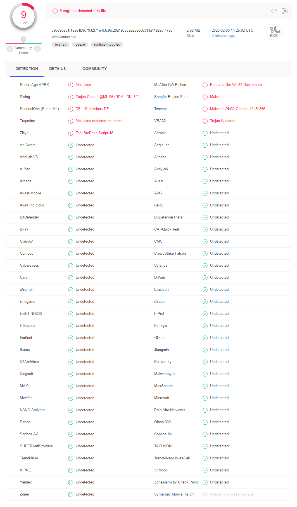

# WebCourse [QtGUI]

## What's This 
为方便用户操作，同时也是完成自己的一个小心愿。利用QT(PyQt5)为webCourse项目制作了一个简单的界面。
如果你不知道什么是webCourse的话，点击[这里](https://github.com/MrBeike/webCourse)。

## What's LookLike

## What's TODO
- “实验室”选项卡内功能还未完成。
- 消息提示功能还不够完善。
- 其他还没想到。
  
## How to use it
  WebCourse GUI 1.0发布啦，撒花✿✿ヽ(°▽°)ノ✿  --2020年2月5日21:06:36
- 在[Release](https://github.com/MrBeike/WebCourse-QTGUI/releases)页面下载。
- 在[百度网盘](https://pan.baidu.com/s/1mBzYuhjLF5DRChnxUdEw2g)下载。`分享码:8hrw`

## How to build it
+ 克隆项目到本地    `git clone https://github.com/MrBeike/WebCourse-QTGUI.git`
+ 安装必要第三方库   `pip install -r requirements.txt`
+ 运行pyinstaller打包  `pyinstaller -D launcher.spec(文件夹版)`  `pyinstaller -F launcher.spec(单个可执行文件)`
+ Binggo!

## Knowing Issue
+ PyQt 5.13 文件夹模式打包后，会提示 `unable to find Qt5Core.dll on PATH` 
  - 解决方案：将提示的dll文件复制到dist下 `PyQt5\Qt\bin`中，或使用5.12.2版本PyQt。
  - 参考链接：https://github.com/pyinstaller/pyinstaller/issues/4293
+ 部分杀毒软件报告病毒
  - 初步认定是pyinstaller打包造成部分杀软报毒。程序本身并无恶意代码。
  - 正在尝试通过`rebuild pyinstaller bootloader`解决问题。(360依旧报毒,据说是专有的误杀。所以，请自行判断使用。)
  - 附上之前发布的webcourse.exe在线杀毒结果 by [virustotal](https://www.virustotal.com/).com.
  

## Contact Me
- Mail: lbbas@126.com
